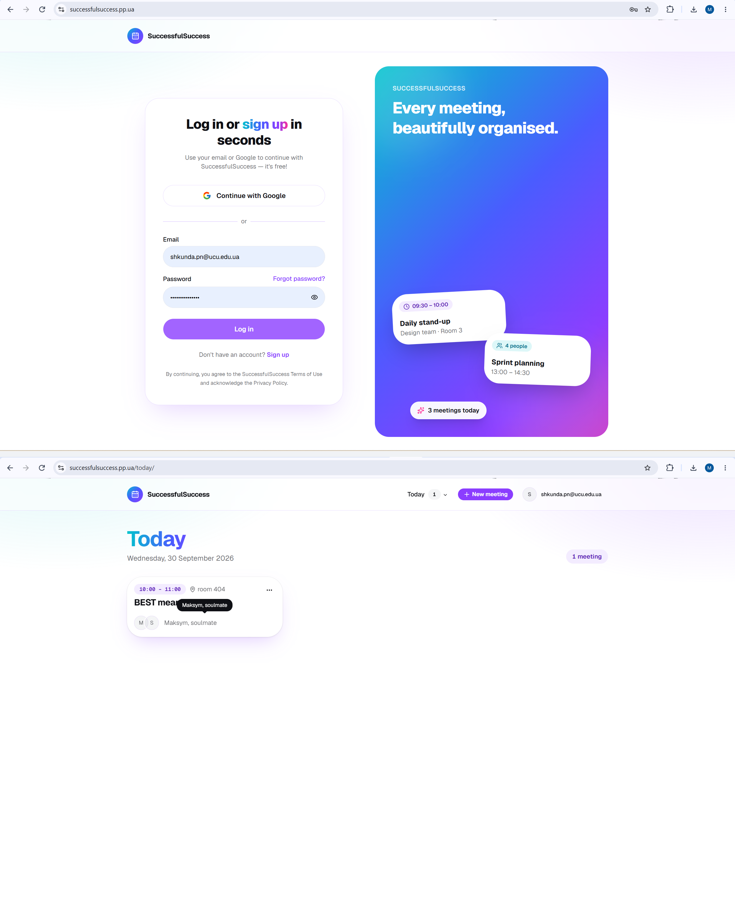
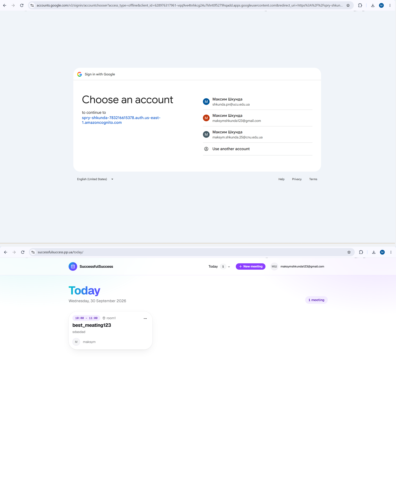
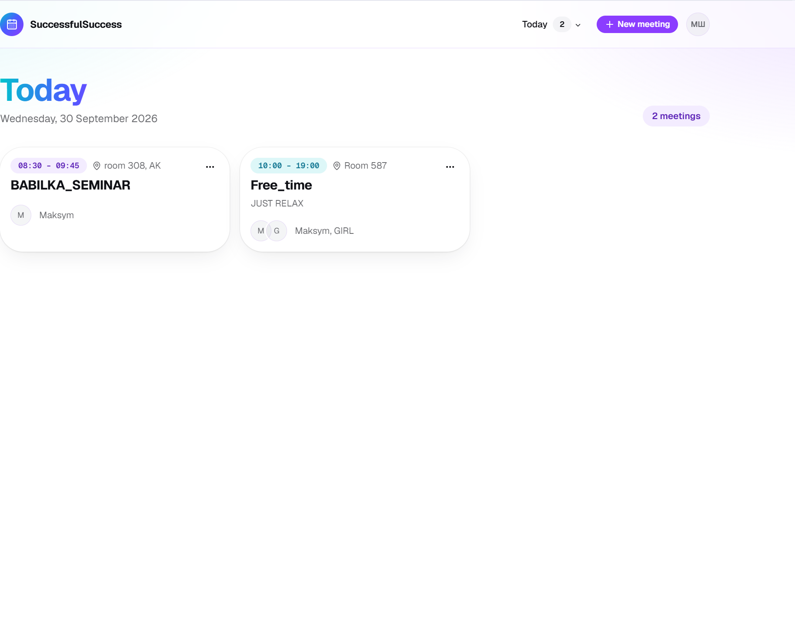

# Submission: Authentication with AWS Cognito & Deployment

**Student:** Maksym Shkunda (`shkunda.pn@ucu.edu.ua`)  
**Repository:** [https://github.com/shkundapn/SuccessfulSuccess_shkunda](https://github.com/shkundapn/SuccessfulSuccess_shkunda)  
**Evaluation Target:** Course Lab Assignment — AWS Cognito Authentication & Custom Domain Deployment  

---

## 1. Login Page URL (HTTPS on Custom Domain)

* **Primary Login URL:**  
  `https://successfulsuccess.pp.ua/login/`  
  Markdown link: [https://successfulsuccess.pp.ua/login/](https://successfulsuccess.pp.ua/login/)
* **Root Application URL:**  
  `https://successfulsuccess.pp.ua`  
  Markdown link: [https://successfulsuccess.pp.ua](https://successfulsuccess.pp.ua)
* **Direct CloudFront Fallback:**  
  `https://d1lbnhcst4jnzp.cloudfront.net`  
  Markdown link: [https://d1lbnhcst4jnzp.cloudfront.net](https://d1lbnhcst4jnzp.cloudfront.net)

### Automated Verification for Evaluator:
```bash
# Verify login page returns HTTP 200
curl -sI https://successfulsuccess.pp.ua/login/

# Verify backend health and RDS database connection
curl -s https://omp54u5dee63qjrnyqz74wo42y0brxmp.lambda-url.us-east-1.on.aws/health
```

### Supported Features Verified:
- **Email & Password:** Full self-registration ("Sign up") and sign-in.
- **Continue with Google:** Federated OAuth 2.0 flow via Cognito domain `spry-shkunda-783216615378.auth.us-east-1.amazoncognito.com`.
- **Session & Profile Synchronization:** On successful sign-in, redirects to `/today/`, calls `POST /api/v1/me/sync`, and displays the authenticated user's **email directly in the top header bar**.

---

## 2. Two Screenshots of User Signed In (Email Visible in Header)

### A. Signed In with Email & Password
* **Image File:** `01_password_signin_flow.png`  
* **Raw Link:** [https://raw.githubusercontent.com/shkundapn/SuccessfulSuccess_shkunda/main/submission/01_password_signin_flow.png](https://raw.githubusercontent.com/shkundapn/SuccessfulSuccess_shkunda/main/submission/01_password_signin_flow.png)  
* **Verification Detail:** Top shows login credentials form; bottom shows `/today/` with email **`shkunda.pn@ucu.edu.ua`** clearly rendered in the site header.



---

### B. Signed In with Google
* **Image File:** `02_google_signin_flow.png`  
* **Raw Link:** [https://raw.githubusercontent.com/shkundapn/SuccessfulSuccess_shkunda/main/submission/02_google_signin_flow.png](https://raw.githubusercontent.com/shkundapn/SuccessfulSuccess_shkunda/main/submission/02_google_signin_flow.png)  
* **Verification Detail:** Top shows Google OAuth account chooser targeting Cognito; bottom shows `/today/` with Google account email **`maksymshkunda123@gmail.com`** clearly rendered in the site header.



---

### C. Supporting Screenshot: Running Frontend & Today's Meetings
* **Image File:** `03_meetings_list.png`  
* **Raw Link:** [https://raw.githubusercontent.com/shkundapn/SuccessfulSuccess_shkunda/main/submission/03_meetings_list.png](https://raw.githubusercontent.com/shkundapn/SuccessfulSuccess_shkunda/main/submission/03_meetings_list.png)



---

## 3. Link to the Commit that Adds Cognito

* **Primary Commit Link:**  
  `https://github.com/shkundapn/SuccessfulSuccess_shkunda/commit/557c76efaa810a1fb5a89aa54158bc7239816c98`  
  Markdown link: [`557c76efaa810a1fb5a89aa54158bc7239816c98`](https://github.com/shkundapn/SuccessfulSuccess_shkunda/commit/557c76efaa810a1fb5a89aa54158bc7239816c98)

### Key Changes in this Commit:
1. **Infrastructure Template:** [`infra/auth.yml`](https://github.com/shkundapn/SuccessfulSuccess_shkunda/blob/557c76efaa810a1fb5a89aa54158bc7239816c98/infra/auth.yml)  
   - Declares `AWS::Cognito::UserPool`, `AWS::Cognito::UserPoolDomain`, `AWS::Cognito::UserPoolClient`, and `AWS::Cognito::UserPoolIdentityProvider` (Google).
2. **Frontend Authentication:**
   - [`frontend/components/auth-page.tsx`](https://github.com/shkundapn/SuccessfulSuccess_shkunda/blob/557c76efaa810a1fb5a89aa54158bc7239816c98/frontend/components/auth-page.tsx): Sign-in/Sign-up UI with Google button.
   - [`frontend/lib/auth.ts`](https://github.com/shkundapn/SuccessfulSuccess_shkunda/blob/557c76efaa810a1fb5a89aa54158bc7239816c98/frontend/lib/auth.ts): AWS Amplify configuration.
   - [`frontend/components/user-menu.tsx`](https://github.com/shkundapn/SuccessfulSuccess_shkunda/blob/557c76efaa810a1fb5a89aa54158bc7239816c98/frontend/components/user-menu.tsx): Header user profile menu.
3. **Backend JWT Authentication:**
   - [`backend/app/auth.py`](https://github.com/shkundapn/SuccessfulSuccess_shkunda/blob/557c76efaa810a1fb5a89aa54158bc7239816c98/backend/app/auth.py): Verifies Cognito JWT access and ID tokens via JWKS keys.

### Relevant Supporting Commits:
* [`ecd0592`](https://github.com/shkundapn/SuccessfulSuccess_shkunda/commit/ecd05924184a02094113bb7cec873e2429d713ac) — Pre-Sign-Up Auto-Confirm Lambda trigger.
* [`3c95237`](https://github.com/shkundapn/SuccessfulSuccess_shkunda/commit/3c95237894a4c6a9a08404a80ce05f5ceb0f0254) — Dedicated `/login/` route for direct evaluation.
* [`a529441`](https://github.com/shkundapn/SuccessfulSuccess_shkunda/commit/a5294418659124451921f92e592737a4e52541a7) — Header update explicitly rendering user email text beside avatar.

---

## 4. Production & Configuration Status

* **Self Sign-Up:**  
  Permanently enabled on User Pool `us-east-1_dLIUUyTHp` (`AllowAdminCreateUserOnly: false`).
* **Pre-Sign-Up Auto-Confirm Lambda:**  
  Function `spry-shkunda-auto-confirm` automatically verifies new sign-ups, allowing anyone (including automated or manual reviewers) to register and sign in immediately.
* **Google OAuth App:**  
  Set to Production mode (`openid`, `email`, `profile` scopes) with authorized redirect URI `https://spry-shkunda-783216615378.auth.us-east-1.amazoncognito.com/oauth2/idpresponse`.
* **Backend API & Database:**  
  AWS Lambda Function URL: `https://omp54u5dee63qjrnyqz74wo42y0brxmp.lambda-url.us-east-1.on.aws`  
  RDS PostgreSQL: `spry-shkunda-db` (db.t4g.micro, fully migrated with Alembic).
